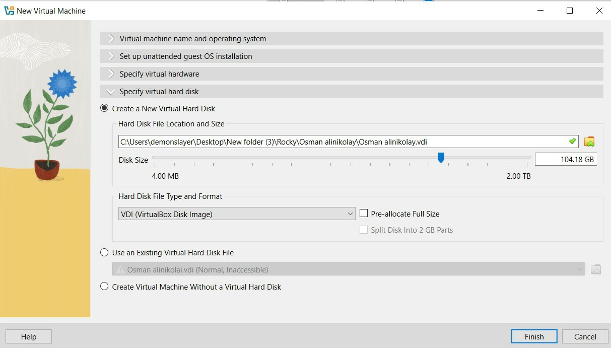
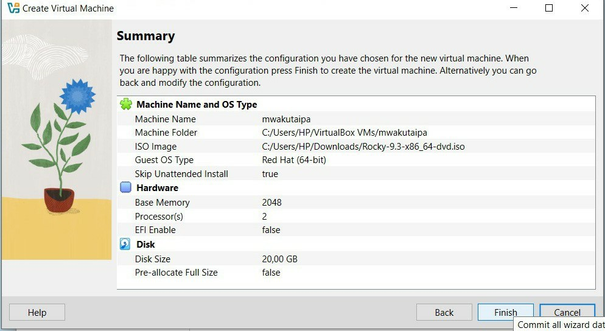
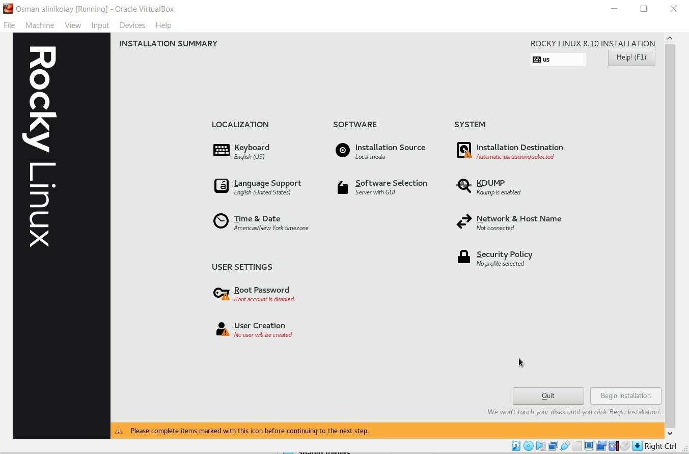
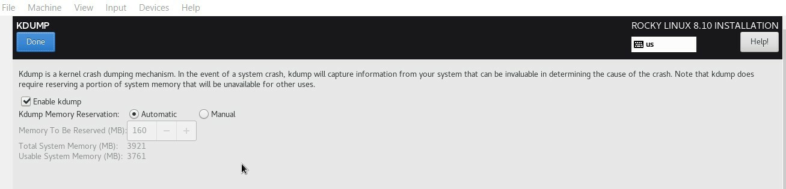
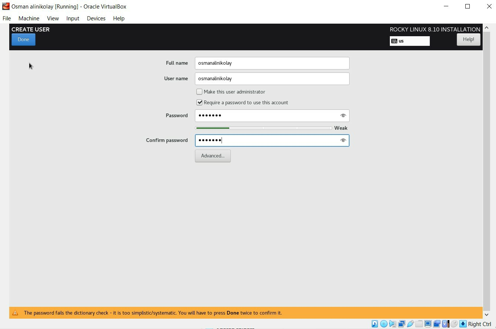
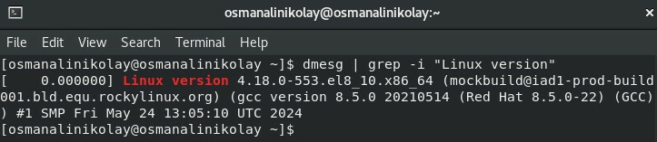

---
## Author
author:
  name: Осман АлиНиколай
  degrees: BSc
  orcid: 
  email: 1032239330@rudn.ru
  affiliation:
    - name: Российский университет дружбы народов
      country: Российская Федерация
      postal-code: 117198
      city: Москва
      address: ул. Миклухо-Маклая, д. 6
## Title
title: лабораторной работе №1
subtitle: Установка и Конфигурация ОС на Виртуальную Машину
license: CC BY
date: today
date-format: "2026-02-15" # Example: 2025-09-06
---

# Информация

## Докладчик

:::::::::::::: {.columns align=center}
::: {.column width="70%"}

   Осман АлиНиколай

   студентка

   Российский университет дружбы народов им. П. Лумумбы

   [1032239330@rudn.ru](1032239330@rudn.ru)
   

:::
::: {.column width="30%"}

:::
::::::::::::::

# Выполнение работы

{#fig:001 width=70%}

## Настроики

{#fig:002 width=70%}

## Настроики

{#fig:003 width=70%}

## Настроики

{#fig:004 width=70%}

## Настроики

{#fig:005 width=70%}

## Настроики

{#fig:008 width=70%}

## Настроики

{#fig:009 width=70%}

## Настроики

{#fig:0010 width=70%}

## Настроики

{#fig:0011 width=70%}

## Установка
 
{#fig:0013 width=70%}

## Установка

{#fig:0014 width=70%}

## Установка

{#fig:0015 width=70%}

## Информация о системе

{#fig:0016 width=70%}

## Информация о системе

{#fig:0017 width=70%}

## Информация о системе

{#fig:0018 width=70%}

# Выводы

Я приобрела практические навыки установки операционной системы на виртуальную машину, настройки минимально необходимых для дальнейшей работы сервисов.
