---
## Author
author:
  name: Осман АлиНиколай
  degrees: BSc
  orcid: 
  email: 1032239330@rudn.ru
  affiliation:
    - name: Российский университет дружбы народов
      country: Российская Федерация
      postal-code: 117198
      city: Москва
      address: ул. Миклухо-Маклая, д. 6

## Title
title: "лабораторной работе №1"
subtitle: "Установка и Конфигурация ОС на Виртуальную Машину"
license: "CC BY"
---

# Цель работы

Приобретение практических навыков установки операционной системы на виртуальную машину.

Цель данного шаблона --- максимально упростить подготовку отчётов по лабораторным работам.
Модифицируя данный шаблон, студенты смогут без труда подготовить отчёт по лабораторным работам, а также познакомиться с основными возможностями разметки Markdown.

# Задание

1. Установить и настроить Rocky Linux.
2. Найти следующую информацию:
	1. Версия Linux
	2. Частота процессора
	3. Модель процессора
	4. Объем доступной оперативной памяти
	5. Тип обнаруженного гипервизора
	6. Тип файловой системы корневого раздела
	7. Последовательность монтирования файловых систем

# Выполнение лабораторной работы

В приложнии VirtualBox создаю новую виртуальную машину. Указываю имя виртуальной машины и добавляю оптический диск. 

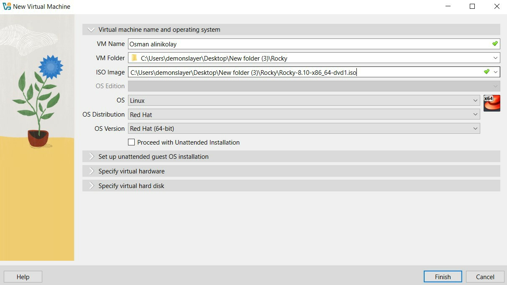{#fig:001 width=70%}

Указываю обьем памяти и создаю виртуальнный жетский диск.

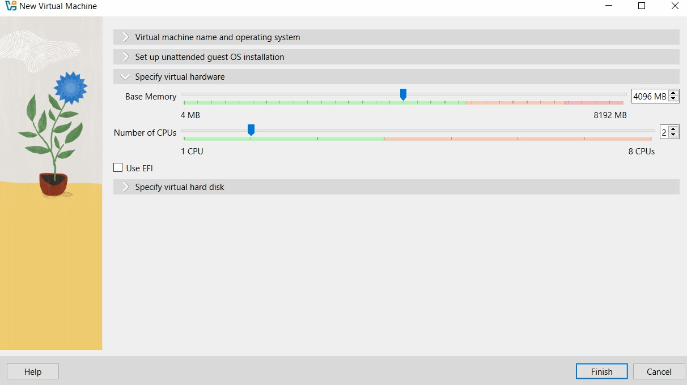{#fig:002 width=70%}

{#fig:003 width=70%}

Соглашаюсь с поставленными настройками.

{#fig:004 width=70%}

Проверяю подключения диска в носителях образ.

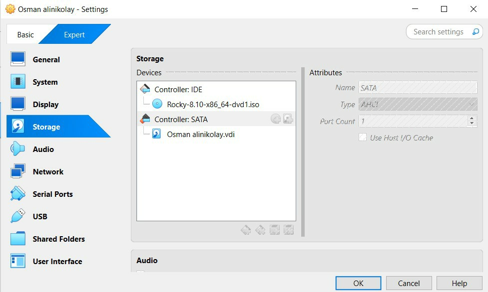{#fig:005 width=70%}

Запускаю машину и устанавливаю систему.

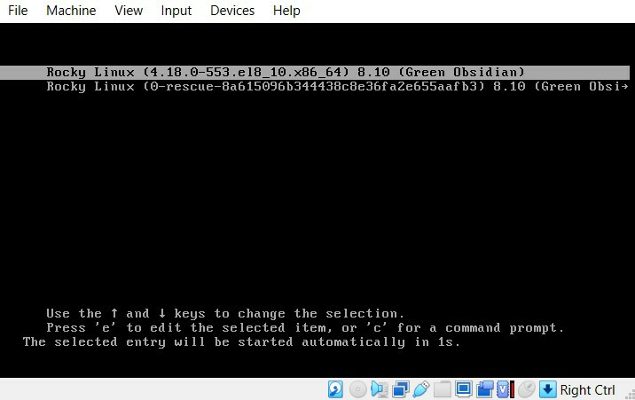{#fig:006 width=70%}

Выбираю язык установки.

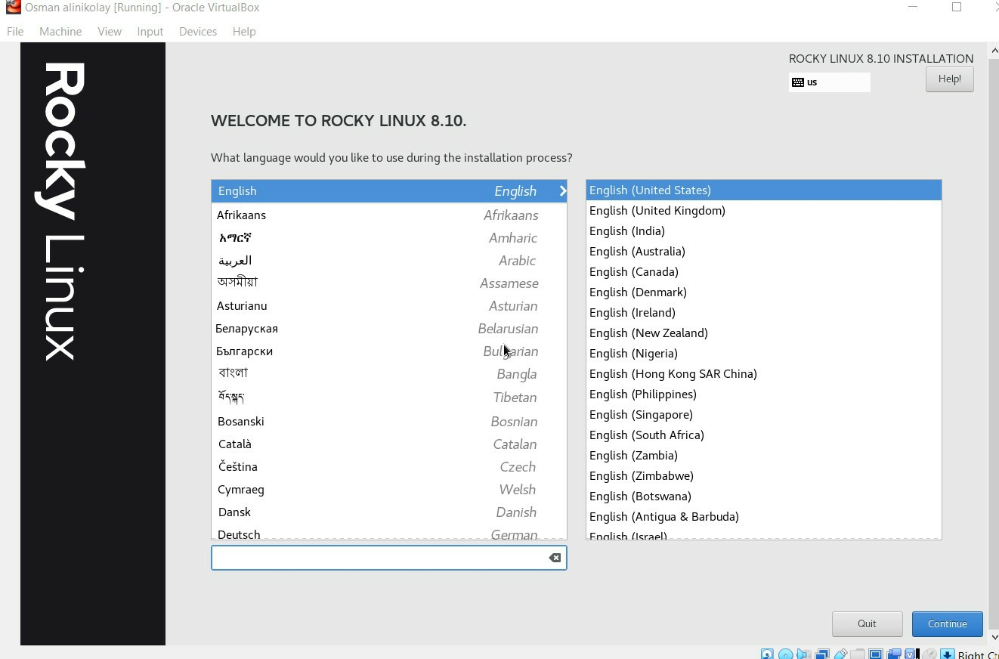{#fig:007 width=70%}

Выбираю место установки, отключаю kdump, создаю пользователя (администратор) и устанавливаю пароль для администратора. 

{#fig:008 width=70%}

{#fig:009 width=70%}

{#fig:0010 width=70%}

Выбираю окружение сервер с GUI и средства разработки в дополнительном программном обеспечении.

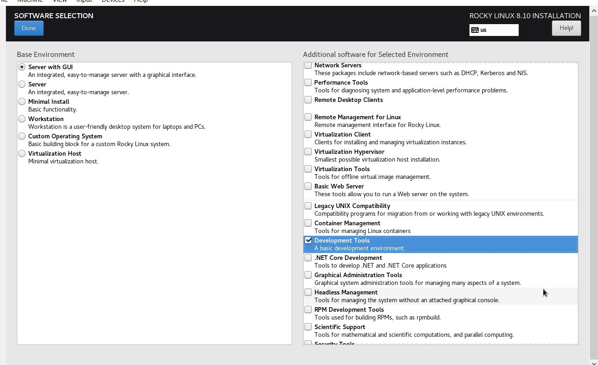{#fig:0011 width=70%}

Указываю имя узла.

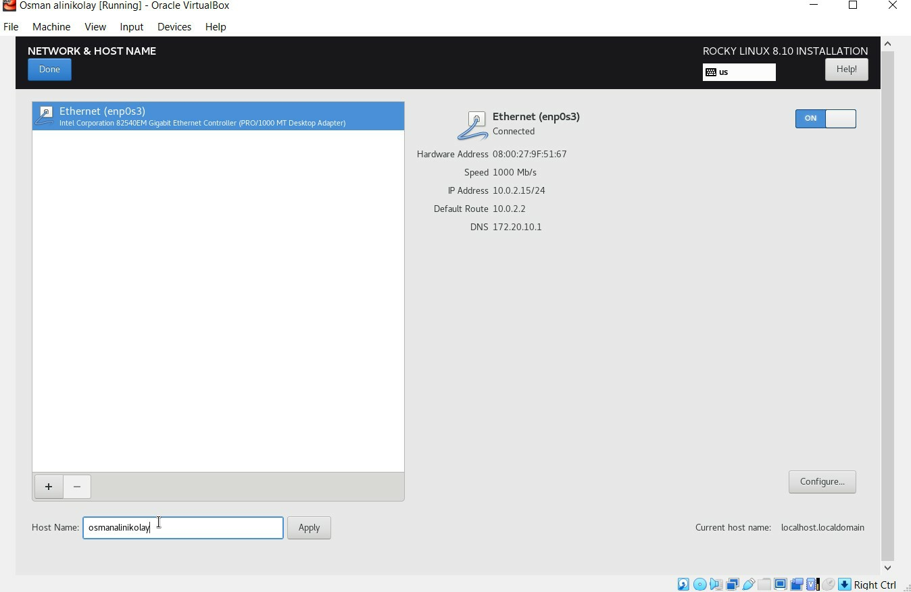{#fig:0012 width=70%}

Затем устанавливаю систему.
 
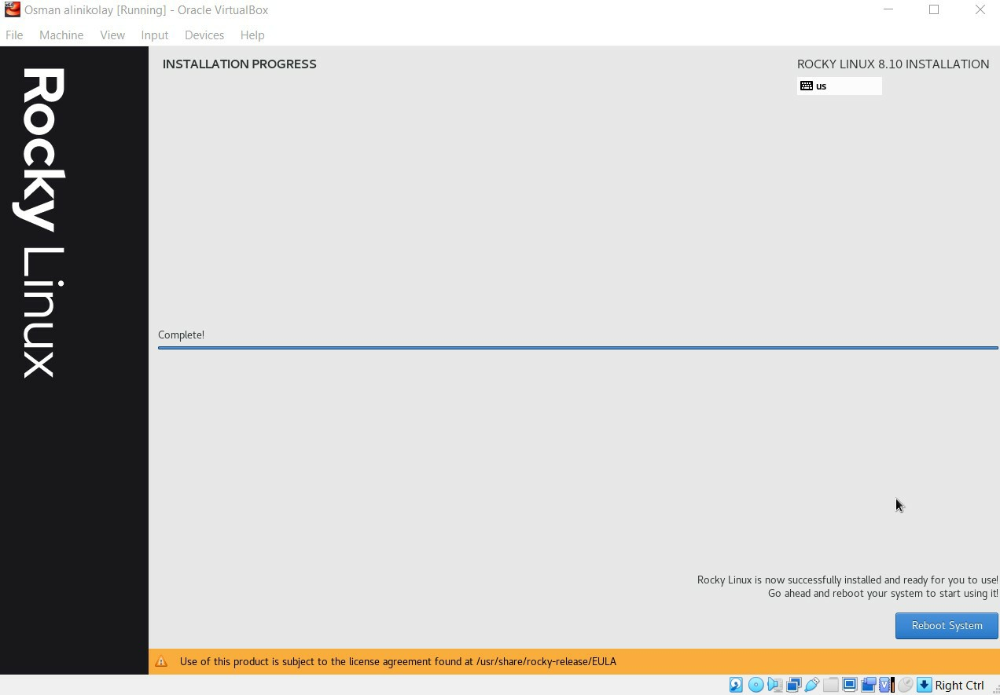{#fig:0013 width=70%}

После завершения установки образ диска пропадет из носителей.

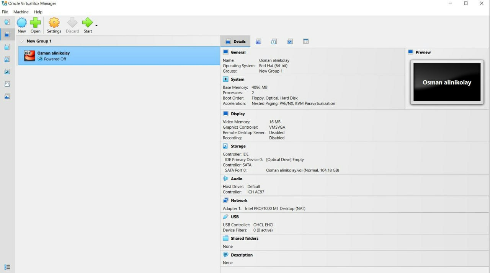{#fig:0014 width=70%}

При запуске виртуальной машины появляется окно выбора пользователя.

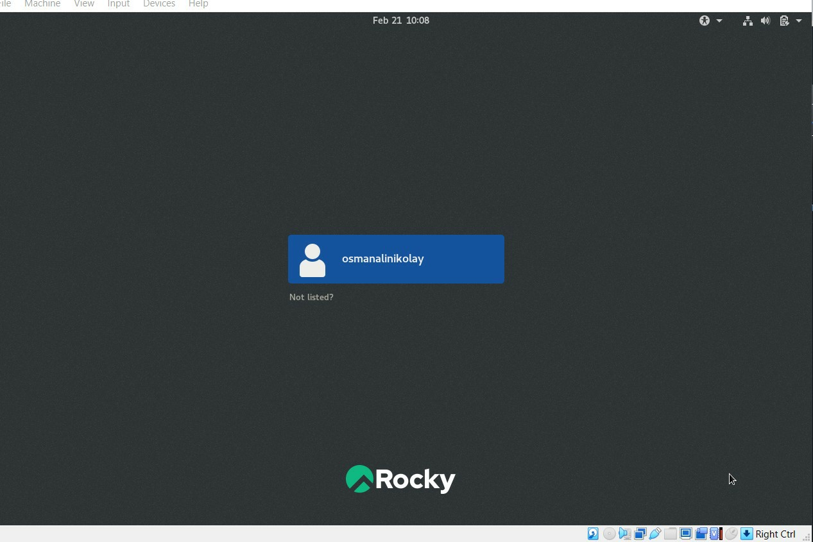{#fig:0015 width=70%}

# Выполнение дополнительной работы

Запускаю в терминале: dmesg | grep -i "Linux version", чтобы получить информацию о ядра.

{#fig:0016 width=70%}

dmesg | grep -i "detected", чтобы получить информацию о процессоре.

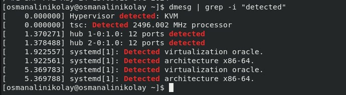{#fig:0017 width=70%}

dmesg | grep -i "CPU", чтобы получить информацию о модели процессора.

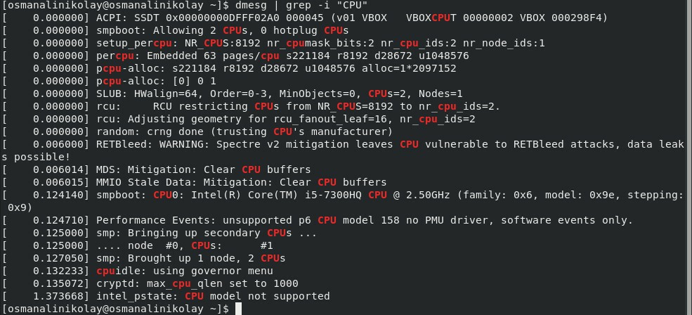{#fig:0018 width=70%}

dmesg | grep -i "memory", чтобы получить информацию о памяти.

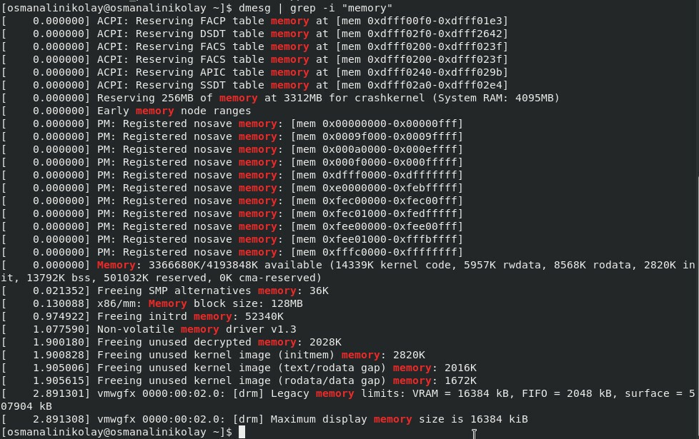{#fig:0019 width=70%}

dmesg | grep -i "detected", чтобы получить информацию о гипервизоре.

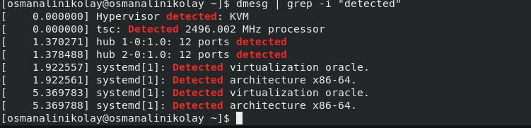{#fig:0020 width=70%}

sudo fdisk -l, чтобы получить информацию о файловой системе корневого раздела.

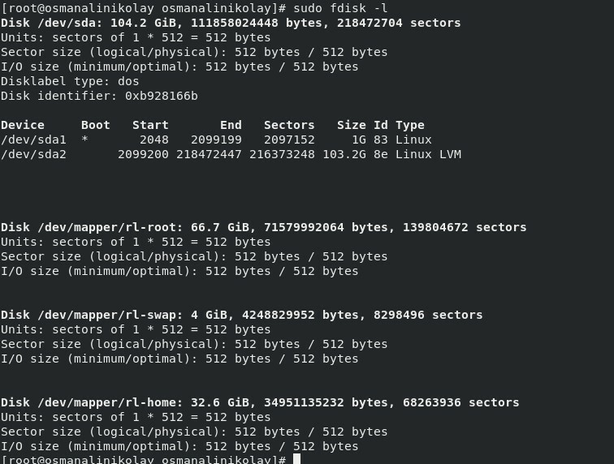{#fig:0021 width=70%}

dmesg | grep -i "mount", чтобы получить информацию о монтировании файловых систем.

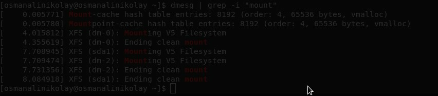{#fig:0022 width=70%}

# Ответы на контрольные вопросы

1. Учетная запись содержит необходимые для идентификации пользователя при подключении к системе данные, а так же информацию для авторизации и учета: системного имени (user name) (оно может содержать только латинские буквы и знак нижнее подчеркивание, еще оно должно быть уникальным), идентификатор пользователя (UID) (уникальный идентификатор пользователя в системе, целое положительное число), идентификатор группы (CID) (группа, к к-рой относится пользователь. Она, как минимум, одна, по умолчанию - одна), полное имя (full name) (Могут быть ФИО), домашний каталог (home directory) (каталог, в к-рый попадает пользователь после входа в систему и в к-ром хранятся его данные), начальная оболочка (login shell) (командная оболочка, к-рая запускается при входе в систему).

2. Для получения справки по команде: <команда> —help; для перемещения по файловой системе - cd; для просмотра содержимого каталога - ls; для определения объёма каталога - du <имя каталога>; для создания / удаления каталогов - mkdir/rmdir; для создания / удаления файлов - touch/rm; для задания определённых прав на файл / каталог - chmod; для просмотра истории команд - history

3. Файловая система - это порядок, определяющий способ организации и хранения и именования данных на различных носителях информации. Примеры: FAT32 представляет собой пространство, разделенное на три части: олна область для служебных структур, форма указателей в виде таблиц и зона для хранения самих файлов. ext3/ext4 - журналируемая файловая система, используемая в основном в ОС с ядром Linux.

4. С помощью команды df, введя ее в терминале. Это утилита, которая показывает список всех файловых систем по именам устройств, сообщает их размер и данные о памяти. Также посмотреть подмонтированные файловые системы можно с помощью утилиты mount.

5. Чтобы удалить зависший процесс, вначале мы должны узнать, какой у него id: используем команду ps. Далее в терминале вводим команду kill < id процесса >. Или можно использовать утилиту killall, что "убьет" все процессы, которые есть в данный момент, для этого не нужно знать id процесса. 

# Выводы

Я приобрела практические навыки установки операционной системы на виртуальную машину, настройки минимально необходимых для дальнейшей работы сервисов.

# Список литературы{.unnumbered}

::: {#refs}
:::
