---
## Author
author:
  name: Осман АлиНиколай
  degrees: BSc
  orcid: 
  email: 10322393306@rudn.ru
  affiliation:
    - name: Российский университет дружбы народов
      country: Российская Федерация
      postal-code: 117198
      city: Москва
      address: ул. Миклухо-Маклая, д. 6
## Title
title: Презентация по второй лабораторной работе
subtitle: Атрибуты файлов
license: CC BY
date: today
date-format: "2026-2-21" # Example: 2025-09-06
---

# Информация

## Докладчик

:::::::::::::: {.columns align=center}
::: {.column width="70%"}

   Осман АлиНиколай

   студентка

   Российский университет дружбы народов им. П. Лумумбы

   [1032239330@rudn.ru](10322393306@rudn.ru)

   <https://amjaddawud.github.io/ru/>

:::
::: {.column width="30%"}

:::
::::::::::::::

# Вводная часть

## Цель работы

Получение навыков работы в консоли с атрибутами файлов, закрепление теоретических основ дискреционного разграничения доступав современных системах с открытым кодом на базе ОС Linux.

## Задание

1. Работа с атрибутами  файлов
2. Заполнение таблиц

# Выполнение лабораторной работы

## Атрибуты файлов

Через учетную запись администратора создаю нового пользователя guest и задаю пароль.

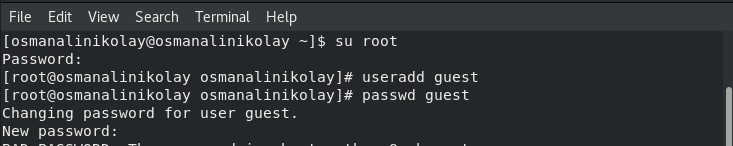{#fig:001 width=70%}

## Атрибуты файлов

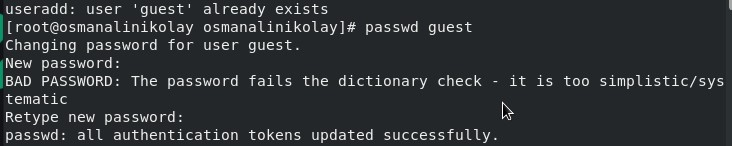{#fig:002 width=70%}

## Атрибуты файлов

Вхожу в системе от имени ползователя guest и определяю, где нахожусь с помощью pwd.

{#fig:003 width=70%}

## Атрибуты файлов

Уточняю имя пользователя.

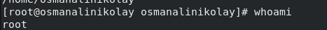{#fig:004 width=70%}

## Атрибуты файлов

Groups выводит информция о названии группы, к которой относится пользователь. id выводит больше информации чем groups (имя пользователя и группыб коды группы и пользователя). 

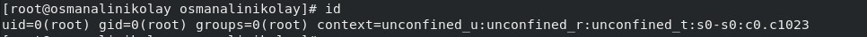{#fig:005 width=70%}

## Атрибуты файлов

С помощью cat /etc/passwd | grep guest вывожу свою учетную запись и адрес домашней директории. 

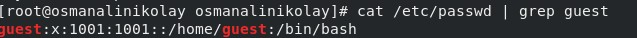{#fig:006 width=70%}

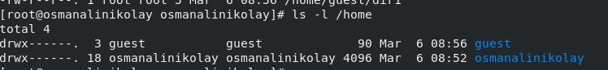{#fig:006 width=70%}

## Атрибуты файлов

список поддиректорий директории home получилось получить с помощью команды ls -l

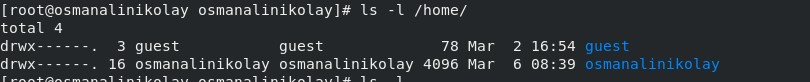{#fig:007 width=70%}

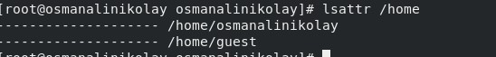{#fig:007 width=70%}

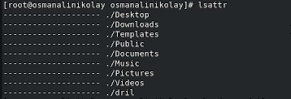{#fig:007 width=70%}

## Атрибуты файлов

Создаю поддиректорию dir1 для домашней директории. Расширенные атрибуты командой lsattr просмотреть у директории не удается, но атрибуты есть: drwxr-xr-x, их удалось просмотреть с помощью команды ls -l

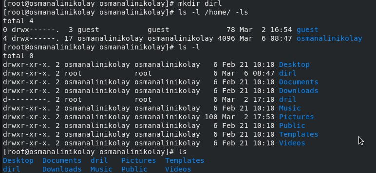{#fig:008 width=70%}

## Атрибуты файлов

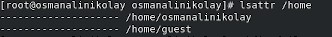{#fig:009 width=70%}

## Атрибуты файлов

Снимаю атрибуты командой chmod 000 dir1, при проверке с помощью команды ls -l видно, что теперь атрибуты действительно сняты.
 
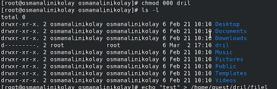{#fig:010 width=70%}

## Атрибуты файлов

Попытка создать файл в директории dir1. Выдает отказано в доступе. Вернув права директории и использовав снова командy ls -l можно убедиться, что файл не был создан.

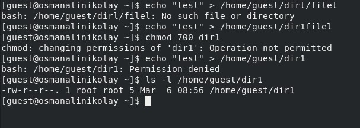{#fig:013 width=70%}

# Выводы

При выполнении проделанной работы я получила практические навыки работы в консоли с атрибутами файлов, закрепление теоретических основ дискреционного разграничения доступав современных системах с открытым кодом на базе ОС Linux.