---
## Author
author:
  name: Осман АлиНиколай
  degrees: BSc
  orcid: 
  email: 1032239330@rudn.ru
  affiliation:
    - name: Российский университет дружбы народов
      country: Российская Федерация
      postal-code: 117198
      city: Москва
      address: ул. Миклухо-Маклая, д. 6
## Title
title: Структура научной презентации
subtitle: Простейший вариант
license: CC BY
date: today
date-format: "2026-04-17" # Example: 2025-09-06
---

# Информация

## Докладчик

:::::::::::::: {.columns align=center}
::: {.column width="70%"}

   Осман АлиНиколай

   студент

   Российского университета дружбы народов им. П. Лумумбы

   [1032239330@rudn.ru](1032239330@rudn.ru)


:::
::: {.column width="30%"}


:::
::::::::::::::

# Цель работы

Изучение механизмов изменения идентификатаровб применения SetUID и Sticky-битов. Получение практических навыков работы в консоли с дополнительными атрибутами. Рассмотрение работы механизма смены идентификатора процессов пользователей, а также влияние бита Sticky на запись и удаление файлов. 

# Выполнение лабораторной работы

## Проверка рабочее пространство

До начала работы проверила, что имеется средства разработки:

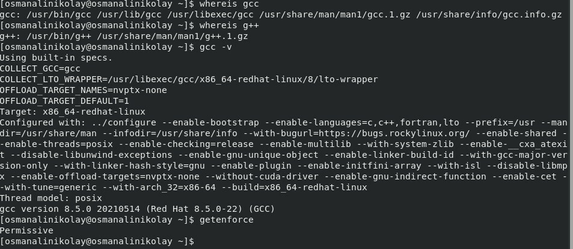{#fig:001 width=30%}

## Создание simpleid.c

Вошел в систему от имени пользователя guest и создала программу simpleid.c:

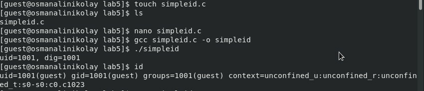{#fig:002 width=70%}

## код программы 1

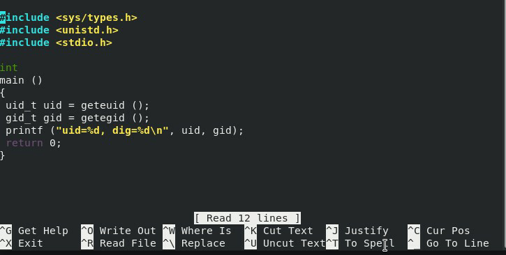{#fig:003 width=70%}

## simpleid.c

Скомпилировал программу и запускаю ее. Она выводит идентификатор пользователя и группы: 

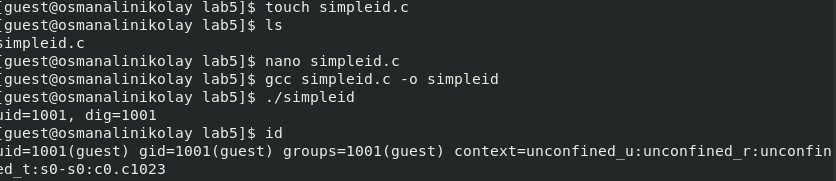{#fig:004 width=70%}

## simpleid2.c

Создал файл simpleid2.c добавив вывод действительных идентификаторов.

{#fig:005 width=70%}

## Вывод simpleid2.c

Скомпилировал программу и запускаю ее.

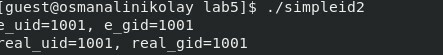{#fig:006 width=70%}

## Изменение права доступа на simpleid2.c

С помощью chown изменяю владельца файла на суперпользователя, с помощью chmod изменяю права доступа

## сравнение simpleid2 на id

Сравнение вывода программы и команды id, наша программа вывела только ограниченное количество информации

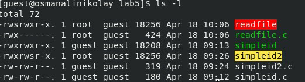{#fig:008 width=70%}

## Программу readfile.c

Создал еще одну программу readfile.c

```
C++ листинг 3
int
main (int argc, char* argv[]){
  unsigned char buffer[16];
  size_t bytes_read;
  int i;
  int fd = open (argv[1], O_RDONLY);
  do{
  bytes_read = read (fd, buffer, sizeof (buffer));
  for (i =0; i < bytes_read; ++i) printf("%c", buffer[i]);}
  while (bytes_read == sizeof (buffer));
  close (fd);
  return 0;
}
```

## Программу readfile.c

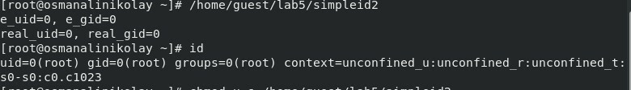{#fig:009 width=70%}

## Смена владельца файла и прав доступа

Снова от имени суперпользователи изменил владельца файла readfile. Далее изменил права доступа так, чтобы пользователь guest не смог прочесть содержимое файла 

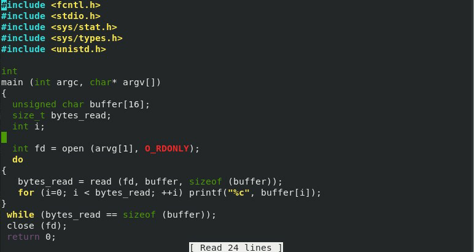{#fig:010 width=30%}

## Попытка прочесть файл

Проверка прочесть файл от имени пользователя guest. Прочесть файл не удается. Попытка прочесть тот же файл с помощью программы readfile, в ответ получаем "отказано в доступе"

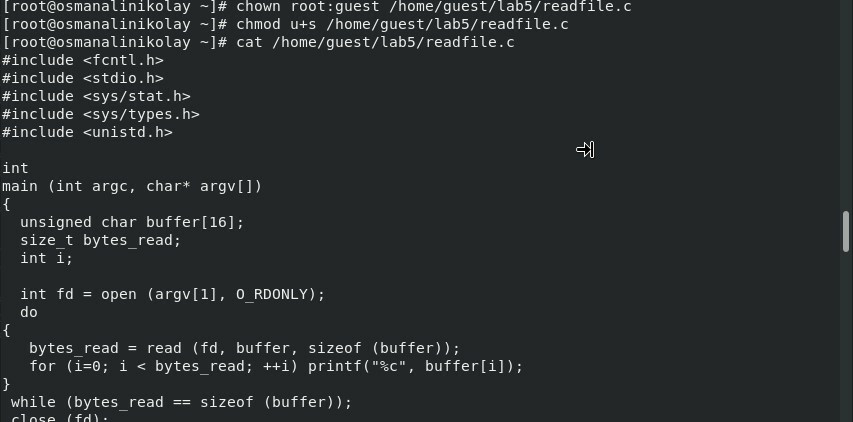{#fig:011 width=70%}

## Попытка 3 прочесть файл

Попытка прочесть файл shadow с помощью программы, все еще получаем отказ в доступе

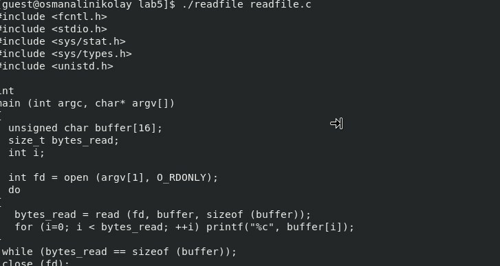{#fig:012 width=70%}

## Чтение файла от суперпользователя

Попробовал прочесть эти же файлы от имени суперпользователя и чтение файлов было успешно

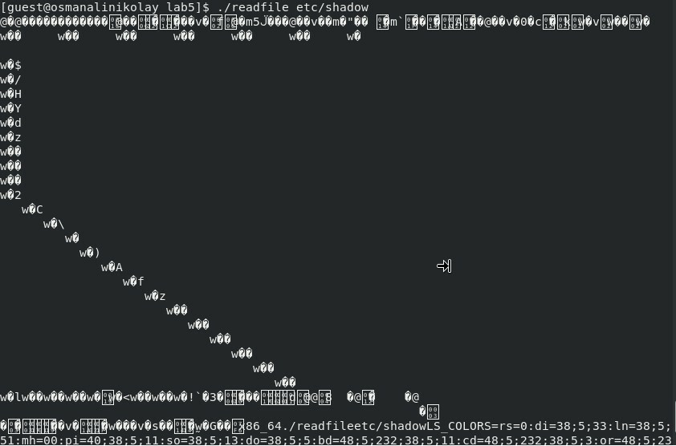{#fig:013 width=70%}

## Создание файла

От имени пользователя guest создаю файл с текстом.

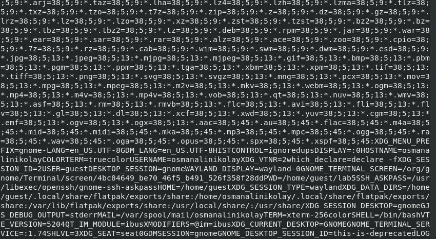{#fig:014 width=70%}

## изменение права доступа

Добавляю права на чтение и запись для других пользователей

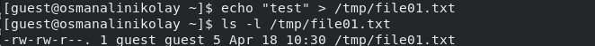{#fig:015 width=70%}

## Проверка файл на чтение, запись и удаление 

Вхожу в систему от имени пользователя guest2, от его имени могу прочитать файл file01.txt, но перезаписать информацию в нем не могу. Также невозможно добавить в файл file01.txt новую информацию от имени пользователя guest2. Когда попробовал удалить файл, снова получил отказ.

{#fig:016 width=50%}

## Снятие атрибута Sticky 

От имени суперпользователя снял с директории атрибут Sticky.

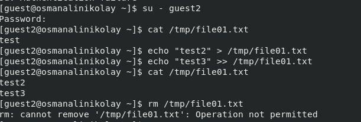{#fig:017 width=70%}

## Повтор предыдущих действий 

Проверил, что атрибут действительно снят и выполнен повтор предыдущих действий. По результатам без Sticky-бита запись в файл и дозапись в файл осталась невозможной

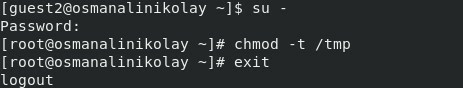{#fig:018 width=50%}

## Изменение атрибутов 

Возвращение директории tmp атрибута t от имени суперпользователя 

{#fig:019 width=70%}

# Выводы

Изучил механизм изменения идентификаторов, применил SetUID- и Sticky-биты. Получил практические навыки работы в консоли с дополнительными атрибутами. Рассмотрел работы механизма смены идентификатора процессов пользователей, а также влияние бита Sticky на запись и удаление файлов.

::: {#refs}
:::
