---
## Author
author:
  name: Осман АлиНиколай
  degrees: BSc
  orcid: 
  email: 1032239330@rudn.ru
  affiliation:
    - name: Российский университет дружбы народов
      country: Российская Федерация
      postal-code: 117198
      city: Москва
      address: ул. Миклухо-Маклая, д. 6
## Title
title: Отчёт по индивидуальному проекту
subtitle: Установка Kali Linux
license: CC BY
date: today
date-format: "2026-02-18" # Example: 2025-09-06
---

# Информация

## Докладчик

:::::::::::::: {.columns align=center}
::: {.column width="70%"}

   Осман АлиНиколай

   студентка

   Российский университет дружбы народов им. П. Лумумбы

   [1032239330@rudn.ru](1032239330@rudn.ru)

:::
::: {.column width="30%"}

:::
::::::::::::::

# Вводная часть

## Цель работы

Получение навыков по установке ОС на менеджер виртуальных машин.

## Задание

Установить дистрибутив Linux.

# Выполнение лабораторной работы

## Название машины

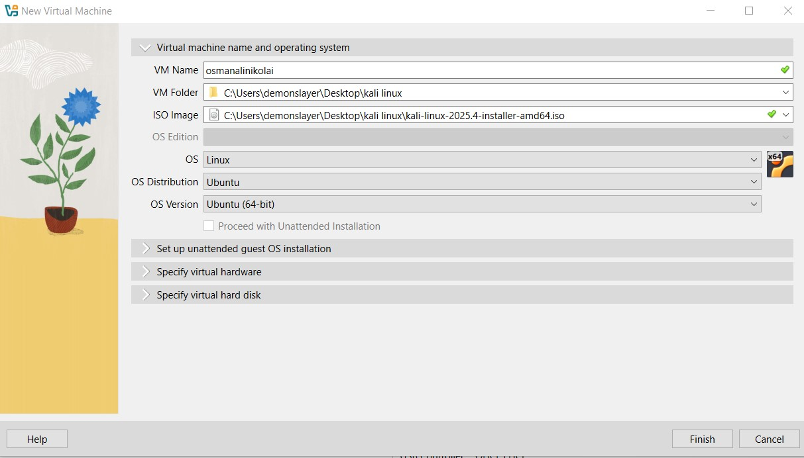{#fig:001 width=70%}

## Окно установки

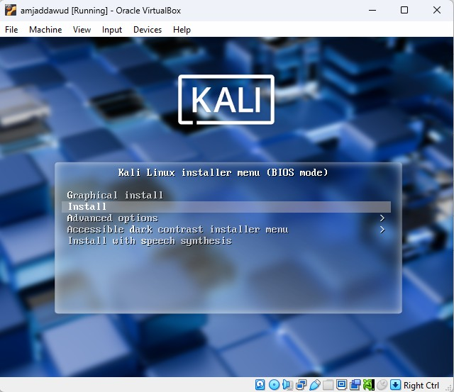{#fig:005 width=70%}

## Подключенный образ

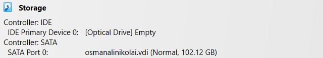{#fig:006 width=70%}

## язык установки

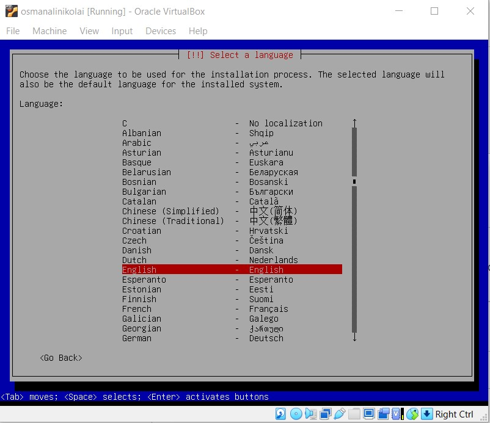{#fig:007 width=70%}

## Локация 

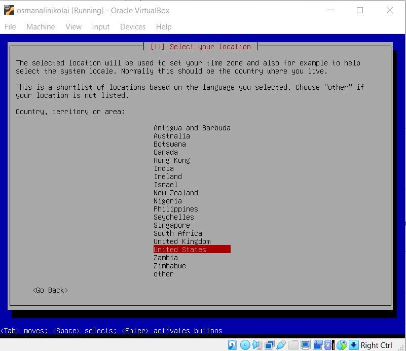{#fig:008 width=70%}

## конфигурация клавиатуры (язык).

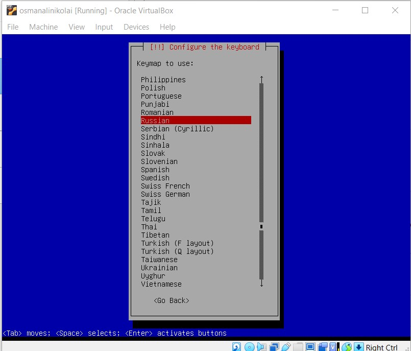{#fig:009 width=70%}

## Настройки сети 

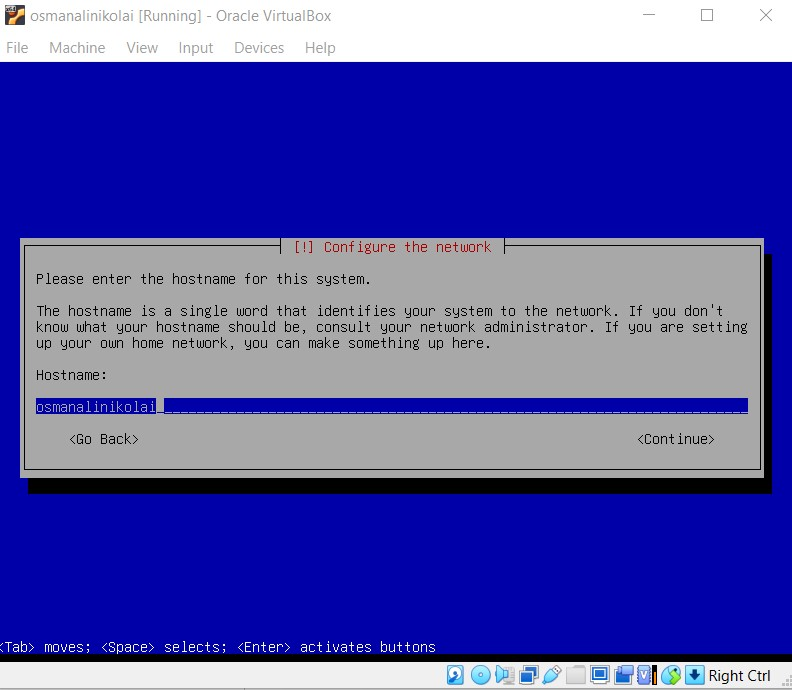{#fig:010 width=70%}

## Создание пользователя 

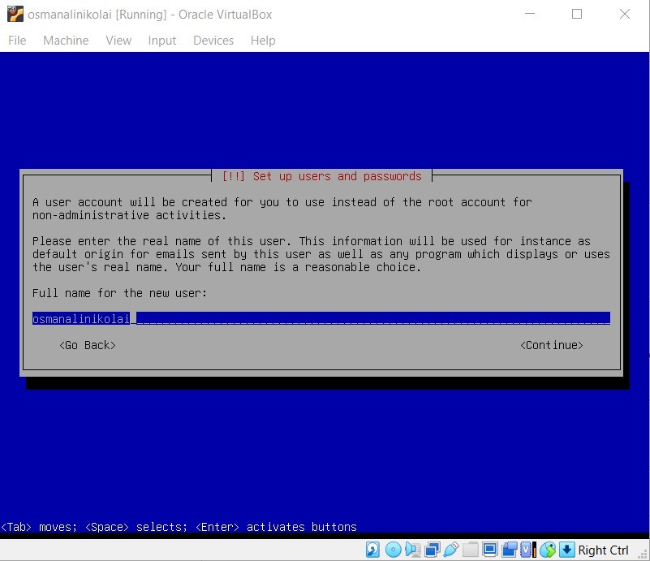{#fig:011 width=70%}

## Настройки часов

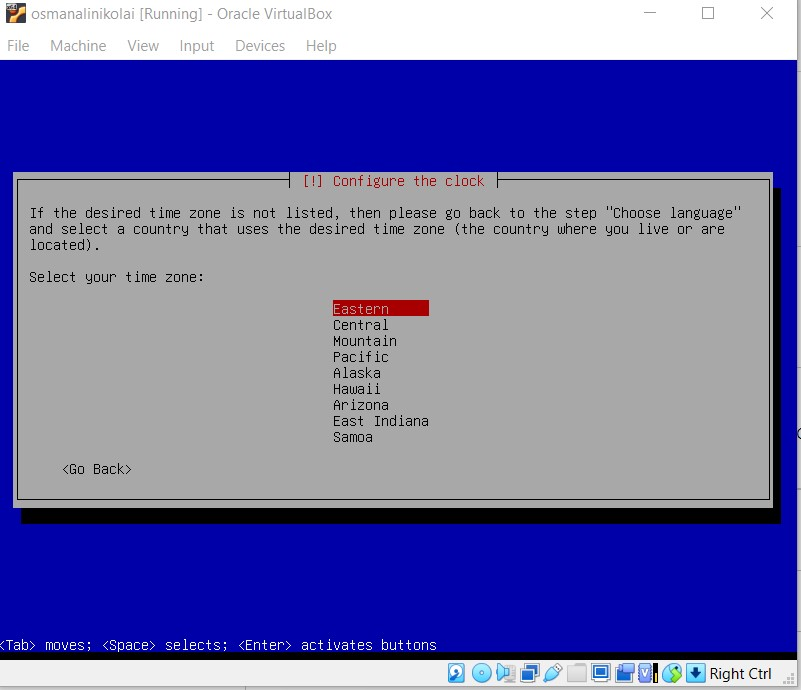{#fig:013 width=70%}

## Выбор диска 

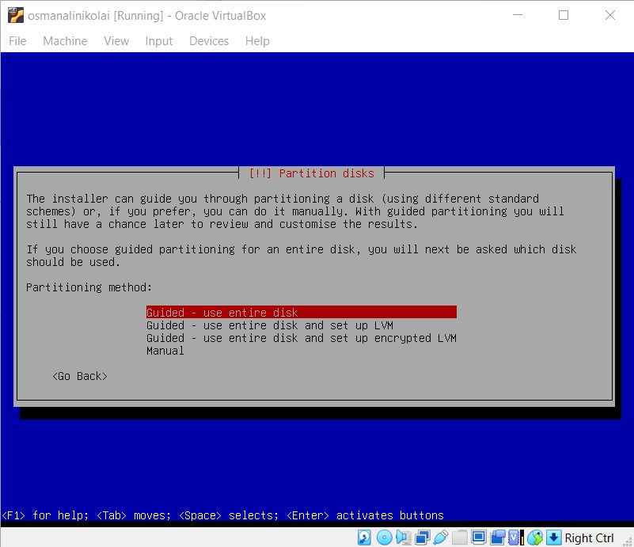{#fig:0014 width=70%}

## Установка системы

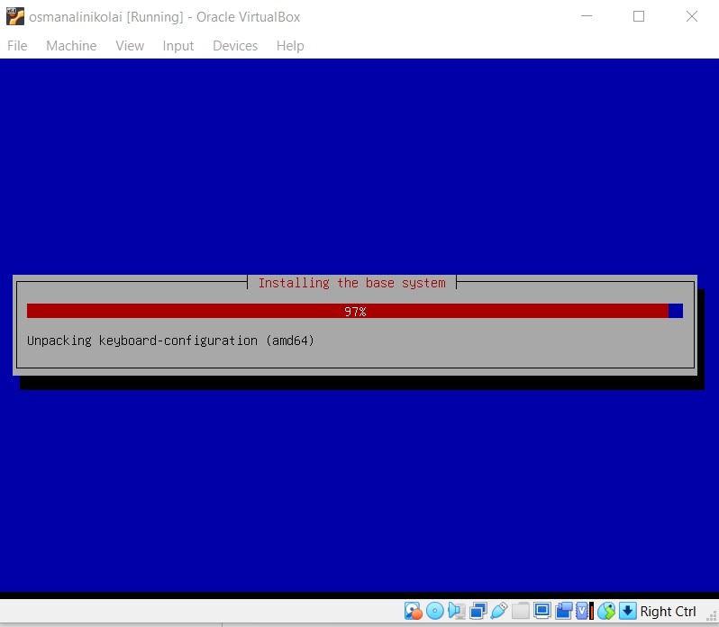{#fig:015 width=70%}

## Выбор UI

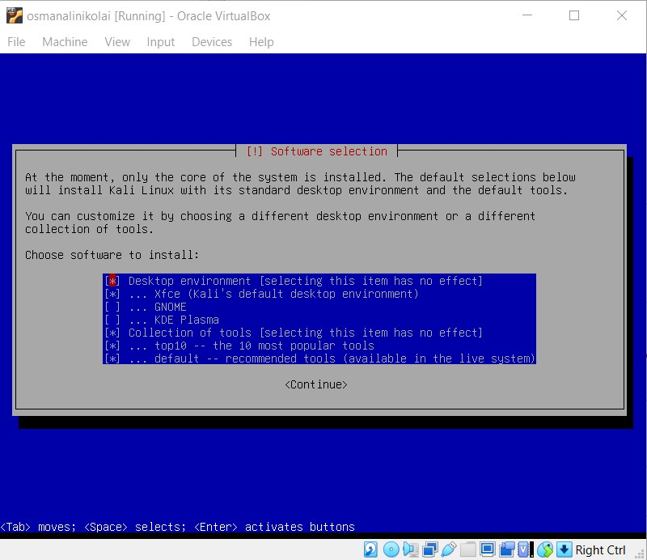{#fig:016 width=70%}

## Домашний экран 

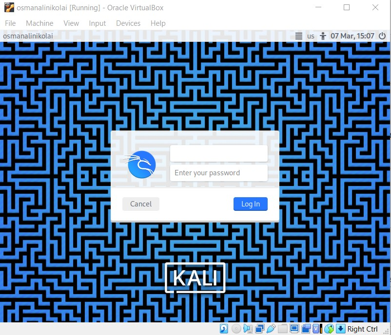{#fig:018 width=70%}

## Пустой носитель

{#fig:019 width=70%}

# Выводы

Получила навыков по установке ОС на менеджер виртуальных машин.
