---
## Author
author:
  name: Осман АлиНиколай
  degrees: BSc
  orcid: 
  email: 1032239330@rudn.ru
  affiliation:
    - name: Российский университет дружбы народов
      country: Российская Федерация
      postal-code: 117198
      city: Москва
      address: ул. Миклухо-Маклая, д. 6
## Title
title: Презентация по первому этапу индивидуального проекта
subtitle: Основы информационной безопасности
license: CC BY
date: today
date-format: "2026-03-04" # Example: 2025-09-06
---

# Информация

## Докладчик

:::::::::::::: {.columns align=center}
::: {.column width="70%"}

   Осман АлиНиколай

   студентка

   Российский университет дружбы народов им. П. Лумумбы

   [1032239330@rudn.ru](1032239330@rudn.ru)

:::
::: {.column width="30%"}

:::
::::::::::::::

## Цель

Приобретение практических навыков по установке DVWA.

# Выполнение лабораторной работы

## 1.1

Настройка DVWA происходит на нашем локальном хосте, поэтому нужно перейти в директорию `/var/www/html`. Затем клонирую нужный репозиторий GitHub

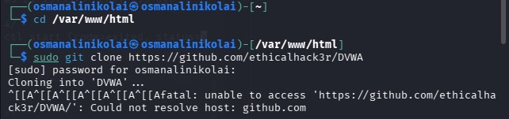{#fig:001 width=70%}

## 1.2

Повышаю права доступа к этой папке до 777

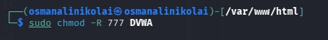{#fig:002 width=70%}

## 1.3

Чтобы настроить DVWA, нужно перейти в каталог `/dvwa/config` 

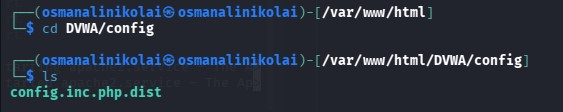{#fig:003 width=70%}

## 1.4

Создаем копию файла, используемого для настройки DVWA `config.inc.php.dist` с именем `config.inc.php`.

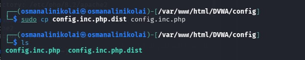{#fig:004 width=70%}

## 1.5

Изменяю данные об имени пользователя и пароле

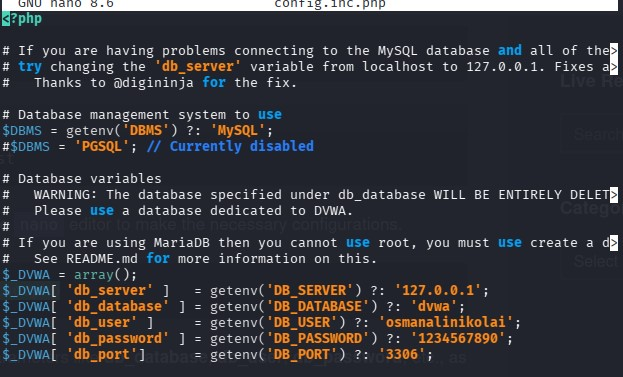{#fig:006 width=70%}

## 2.1

Запускаю mysql

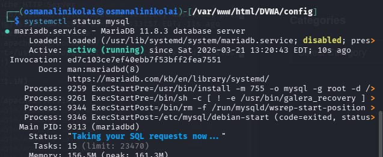{#fig:007 width=70%}

## 2.2

Авторизируюсь в базе данных от имени пользователя root. Создаем нового пользователя, используя учетные данные из файла config.inc.php

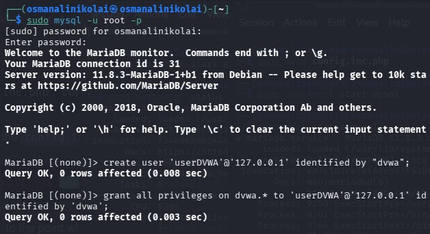{#fig:008 width=70%}

## 2.3

Теперь нужно пользователю предоставить привилегии для работы с этой базой данных

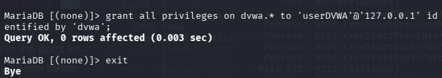{#fig:009 width=70%}

## 3.1

Необходимо настроить сервер apache2, перехожу в соответствующую директорию

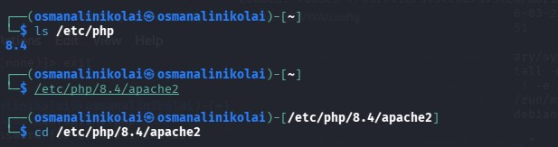{#fig:010 width=70%}

## 3.2

В файле параметры allow_url_fopen и allow_url_include должны быть поставлены как `On` 

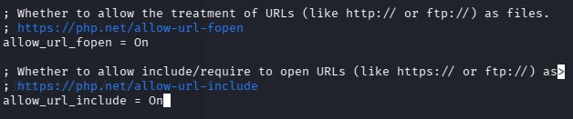{#fig:012 width=70%}

## 3.3

Запускаем службу веб-сервера apache и проверяем, запущена ли служба 

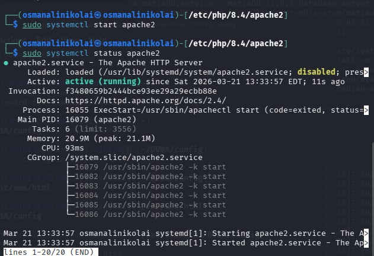{#fig:013 width=70%}

## 4.1

Мы настроили DVWA, Apache и базу данных, поэтому открываем браузер и запускаем веб-приложение, введя 127.0.0/DVWA 

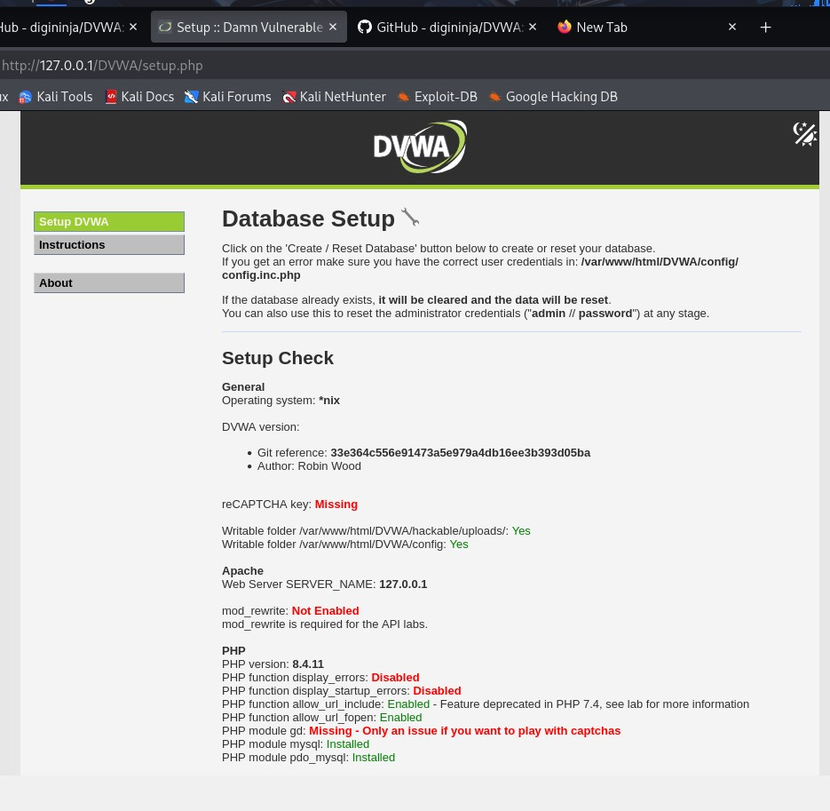{#fig:014 width=70%}

## 4.2

Прокручиваем страницу вниз и нажимем на кнопку `create\reset database`

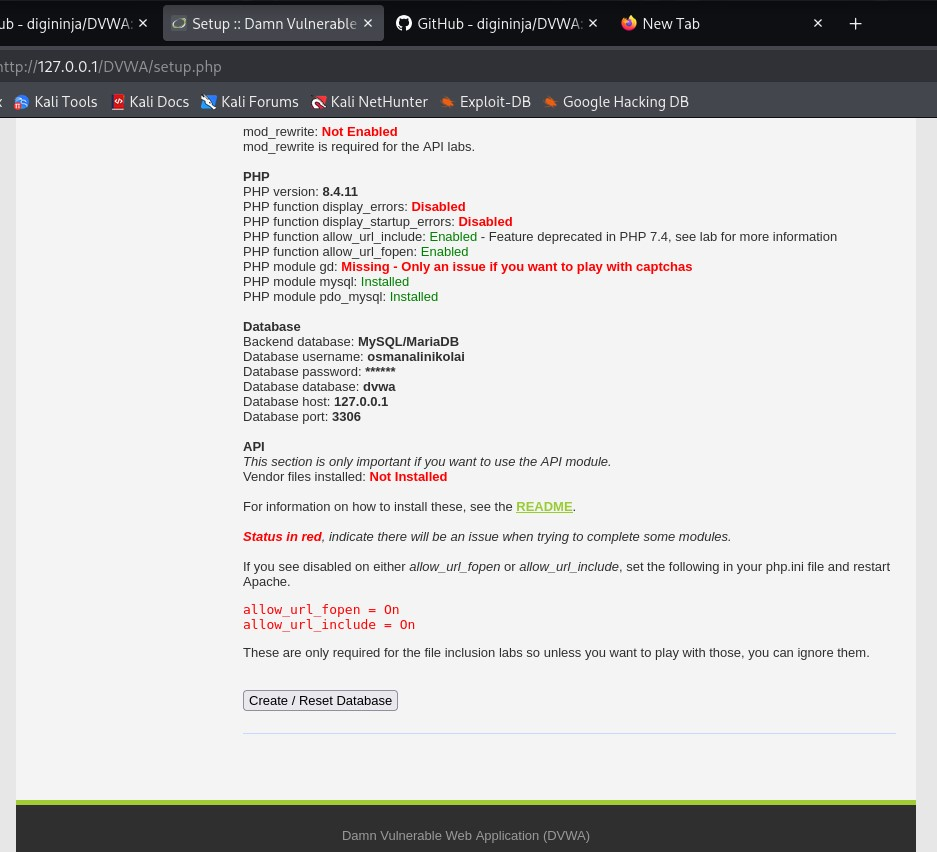{#fig:015 width=70%}

## 4.3

Авторизуюсь с помощью предложенных по умолчанию данных 

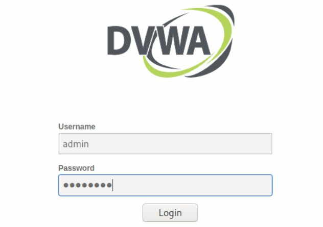{#fig:016 width=70%}

## 4.4

Оказываюсь на домшней странице веб-приложения, на этом установка окончена 

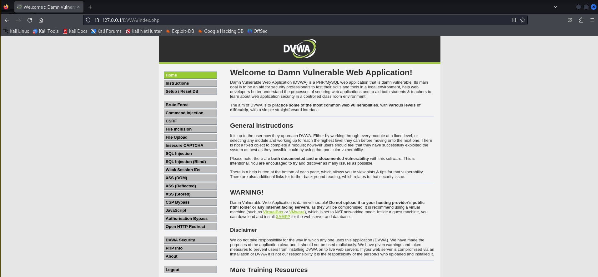{#fig:017 width=70%}

## Вывод

Приобрела практические навыки по установке уязвимого веб-приложения DVWA.

# Спасибо за внимание

:::
